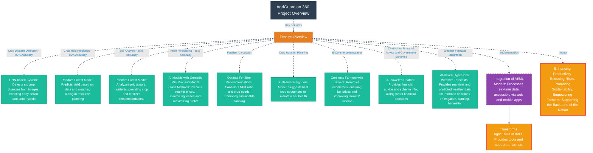

# Agri-2.0

## Overview of the website 

Agri-2.0 is an integrated digital platform designed to address the key challenges faced by farmers today. By leveraging advanced technologies such as AI, machine learning, and data analytics, Agri-2.0 provides farmers with tools to make informed decisions, optimize farming practices, and ultimately increase productivity and profitability.

## Youtube Video Link
https://youtu.be/g81cOqYadBA

## Homepage

## Features

- **Crop Disease Detection**
  
  Uses CNN to identify six crop diseases from uploaded images, enabling early intervention to reduce losses.

- **Crop Yield Prediction**
  
  Employs a Random Forest model with 83% accuracy to forecast yields, aiding in resource planning and management.

- **Price Forecasting**
  
  Fine-tuned with Gemini’s Min-Max and Modal Class methods, this feature predicts market prices to help farmers sell at optimal times.
  
- **Soil Analysis**
  Utilizes a Random Forest model with 91% accuracy for detailed soil insights, offering crop and fertilization recommendations.

- **Fertilizer Calculation**
  Calculates optimal fertilizer use based on NPK ratios and crop requirements, promoting cost-effective nutrient management.

- **Crop Rotation Planning**
  
  Uses a KNN model (85% accuracy) to suggest optimal crop sequences, maintaining soil health and productivity.

- **E-Commerce Integration**
  
  Connects farmers directly with buyers, removing intermediaries to ensure fair pricing and better market access.

- **Chatbot for Financial Advice and Government Schemes**
  
  Provides financial guidance and information on relevant government schemes to support farmer decisions.

- **Weather Forecasting and Disaster Management**
  
  Delivers 7-day weather updates and alerts to help farmers plan activities and mitigate risks.

## Flowchart
# AgriGuardian 360 Project Overview




## Installation

### 1. Clone the Repository

To begin using Agri-2.0, clone the repository to your local machine:

```bash
git clone https://github.com/Chinmay8181/Agri-2.0
cd Agri-2.0
```

### 2. Install Required Python Dependencies

Next, install the required dependencies by running:

```bash
pip install -r requirements.txt
```

### 3. Prerequisites

#### 1. Download Models and Dataset

Download the necessary model files and datasets from Google Drive. You can download the files from the following link: [Google Drive Link](https://drive.google.com/drive/folders/1hhi8HjdHAgqoSTDfT1Pj2JBDk11t6lDa?usp=drive_link)

#### 2. Update Paths in Code

Once you've downloaded the models and datasets, make sure to update the paths in the code to reflect the location of the downloaded files.

In `fapi.py`, update the following paths:

```python
MODEL_PATH = "path/to/crop_yield_model.h5"
ENCODER_PATH = "path/to/label_encoders.pkl"
```

In `fapi-price-pred.py`, update the path to the CSV file:

```python
data = pd.read_csv("path/to/9ef84268-d588-465a-a308-a864a43d0070.csv")
```

In `fapi-yield.py`, update the paths to the model and encoders:

```python
with open("path/to/best_crop_yield_model.pkl", 'rb') as model_file:
    model = pickle.load(model_file)

with open("path/to/label_encoders_yield.pkl", 'rb') as encoder_file:
    label_encoders = pickle.load(encoder_file)
```

#### 3. Add Your Gemini API Key

To integrate the chatbot functionality with the Gemini AI API, you will need to add your Gemini API key.

Navigate to the following file:

`Agri-2.0/my-app/components/universal/Chatbot.jsx`

Then, update the API key as follows:

```javascript
const genAI = new GoogleGenerativeAI("GEMINI_API_KEY");
```

#### 4. Use the Dataset for Disease Detection

To use the disease detection feature, make sure to download the relevant dataset from the Google Drive link provided above. Use the images from this dataset for disease detection.

## Technology Stack

- **Front-End**: Next.js, Tailwind CSS, Material UI, React Leaflet
- **Back-End**: Firebase, Flask, CORS
- **Model Training**: Pickle, NumPy, TensorFlow, Pandas, Scikit-learn

## Usage

### 1. Running the Flask Backend

Run the following files in different terminals:

```bash
python fapi.py
python fapi-price-pred.py
python fapi-yield.py
python fapi-soil.py
```

### 2. Starting the Front-End Application

Navigate to the front-end application directory and start the Next.js application:

```bash
cd my-app
npm run dev
```

This will start the development server and allow you to interact with the Agri-2.0 platform through the web interface.

